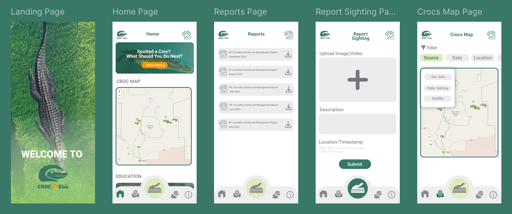
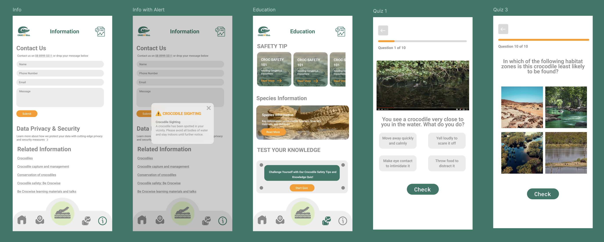

# Team Flaming8 - CrocNTell - GovHack2024

<table>
  <tr>
    <th>Name</th>
    <th>Profession</th>
    <th>Role</th>
  </tr>
  <tr>
    <td><a href="https://www.linkedin.com/in/alisha-kuo/" target="_blank">🥐Alisha Kuo</a></td>
    <td>Software Developer</td>
    <td>Team Captain</td>
  </tr>
  <tr>
    <td><a href="https://www.linkedin.com/in/daya-lee-b462a2299/" target="_blank">🥊Daya Lee</a></td>
    <td>Backend Developer</td>
    <td>Video Editor</td>
  </tr>
  <tr>
    <td><a href="https://www.linkedin.com/in/sarah-mullins-b57910327/" target="_blank">🦦Sarah Mullins</a></td>
    <td>Engineer</td>
    <td>Video Editor</td>
  </tr>
  <tr>
    <td><a href="https://www.linkedin.com/in/casdjani/" target="_blank">🍵Nazira Andjani</a></td>
    <td>Business Support Officer</td>
    <td>UX/UI Designer</td>
  </tr>
  <tr>
    <td><a href="https://www.linkedin.com/in/selija-gangani/" target="_blank">🐿️Selija Gangani</a></td>
    <td>Software Developer</td>
    <td>UX/UI Designer</td>
  </tr>
  <tr>
    <td><a href="https://www.linkedin.com/in/aimee-nguyen-633955173/" target="_blank">🥑Aimee Nguyen</a></td>
    <td>Graduate Data Science</td>
    <td>Data Analyst</td>
  </tr>
  <tr>
    <td><a href="https://www.linkedin.com/in/vedalin/" target="_blank">🧋Veda L</a></td>
    <td>Business Systems Analyst</td>
    <td>Data Analyst</td>
  </tr>
  <tr>
    <td><a href="https://www.linkedin.com/in/jian-qin-liu/" target="_blank">📶Jian-qin L</a></td>
    <td>Software Engineer</td>
    <td>Data Analyst</td>
  </tr>
</table>

# 🐊 Project Description

This project was created for the GovHack 2024 challenge [Crocodile Watch: Enhancing Public Safety](https://hackerspace.govhack.org/challenges/crocodile_watch_enhancing_public_safety) by the Northern Territory Government.

Croc N Tell is a mobile app designed to improve public safety by providing real-time updates on crocodile sightings, predicted hotspots, and the ability for users to report their own sightings with ease. Our goal is to raise awareness and protect communities through accessible, crowd-sourced data and trusted government sources.

**Croc N Tell** is a mobile app designed to enhance public safety by providing **real-time updates** on crocodile sightings, **predicted hotspots**, and allowing users to **easily report** their own sightings. Our mission is to empower communities by providing access to **crowd-sourced** and **trusted data** from government sources, fostering awareness and keeping people safe in crocodile-prone areas.

🎬 Watch the project video [here](notion://www.notion.so/alishak/link).

📱 Play with the prototype [here](https://www.figma.com/proto/WXtBulMF9Ws6HPYayTiFeg/CrocSite?node-id=641-2&node-type=CANVAS&t=YVDw6JMPd2msPjrH-1&scaling=scale-down&content-scaling=fixed&page-id=1669%3A162202&starting-point-node-id=633%3A67&show-proto-sidebar=1).

### Overview

The Northern Territory is known for its rich outback, tropical towns, and ancient Aboriginal culture, making it an ideal destination in Australia. However, it’s also home to **over 100,000 saltwater crocodiles**, up from just 3,000 in the 1970s. With **five crocodiles per kilometre** of waterway, these **apex predators**, which can live up to 70 years and grow over 7 meters long, pose a serious threat to local communities and tourists. Between 2005 and 2018, there were 17 reported crocodile-related fatalities, including a tragic incident in 2024 when a young girl was fatally attacked near Mango Creek.

**Croc N Tell** provides the tools to **navigate the Northern Territory safely**, offering **real-time data** on crocodile locations, and an intuitive platform for **reporting sightings**. By providing reliable and easy-to-access information, our goal is to increase awareness and **reduce the risks** associated with crocodile encounters.

### 💡Solution

Croc N Tell is a mobile app designed to provide real-time information on crocodile sightings, empowering communities to stay safe and informed. It allows users to both access vital data and contribute by reporting their own crocodile encounters, creating a community-driven platform for safety.

The app stands out for its ease of use and accessibility. Users can submit reports without the hassle of signing in, making it particularly suitable for all age groups, including the elderly. This design choice ensures quick reporting and broad participation in crocodile awareness efforts. The interface is color-coded in green and orange to represent crocodiles and the Northern Territory, respectively.

### 🌟Key Features

🗺️ **Crocs Maps**

Explore dynamic croc maps showing real-time and historical crocodile sightings across the Northern Territory. Our app predicts potential hotspots based on weather patterns and user reports, giving you the power to see where crocodile activity is most likely. You can even filter data by source, such as government reports or community sightings, making it easy to stay informed with trusted updates.

📸 **Report Sighting – Contribute Without Hassle**

We’ve made reporting a breeze! No sign-in is required—anyone can quickly submit sightings. Whether you’re a resident or a traveler, you can upload photos, videos, timestamps, and GPS locations. This feature is designed with simplicity in mind, making it easy for elders and less tech-savvy users to participate. Your contribution helps build a more accurate picture of crocodile movements.

📚 **Educational Content – Learn and Stay Safe**

Knowledge is power, and we provide all the resources you need to stay safe. Croc N Tell includes educational content like safety tips, fascinating crocodile facts, and interactive quizzes to test your knowledge. By learning more about these apex predators, you can better protect yourself and your community. Plus, taking the quiz can help improve your reporting accuracy, making your contributions more valuable.

🚨 **Real-Time Alerts**

Receive instant alerts when a crocodile is spotted near your location. These alerts ensure that you can take immediate action to stay safe, whether you're out exploring or at home. Our location-based notifications are designed to provide timely warnings, so you can avoid danger zones and plan your trips with confidence.

📊 **Monthly Report Summaries**

Download comprehensive monthly reports that summarize all crocodile sightings and incidents in a convenient PDF format. These reports include key statistics, sighting trends, and safety insights, allowing users to review activity patterns over time. Stay informed and prepared with just a few clicks!

♿ **Accessibility Features – Open to Everyone**

We’ve built Croc N Tell with accessibility at its core. The app requires no login, making it easier for everyone to access critical safety information and contribute reports. Whether you’re an elderly user or someone new to technology, you can navigate the app effortlessly and participate in improving community safety.

# 📊 Data Story

### Overview

While some government data on crocodile sightings is available, it is limited. We leverage this existing data to gain insights into trends while developing a solution to gather more comprehensive data through user reports. Croc N Tell fills the gaps by encouraging users to report sightings and integrating satellite technology, improving the overall quality and coverage of crocodile data.

### 🔍 Data Insights

Here’s what the data tells us:

1. **Crocodile Distribution**: Croc maps reveal where crocodiles are most prevalent across the Northern Territory.
2. **Monthly Captures**: The app analyzes monthly crocodile capture data over the past 20 years, highlighting patterns in behavior and activity with **March and April** being the most dangerous months for encounters..
3. **Species Analysis**: Insights into the types of crocodiles captured, identifying which species pose the most significant risks.
4. **Temperature and Activity Trends**: Contrary to popular belief, **temperature has little effect** on crocodile activity. Crocodiles remain active all year debunking the myth that higher temperatures affect their activity.
5. **Risk Analysis**:Using historical data and machine learning, we assess the risk of encountering a crocodile, classifying it as low, moderate, high, or very high. Based on the risk level, we generate safety alerts, advising caution or notifying authorities if necessary

### 📈 Usage

**Croc N Tell** leverages **open data** from the Northern Territory Government to provide **insights** and **predictive trends**about crocodile activity. In addition to government data, the app collects **crowd-sourced reports** from users and utilizes **satellite imagery** to offer a comprehensive view of crocodile movements.

By allowing users to submit photos, videos, and detailed reports, Croc N Tell improves data accuracy. Sighting reports are flagged for reliability based on the amount of information provided—those with photos, videos, timestamps, and locations are considered highly reliable.

We are also integrating **satellite technology** to track crocodile movements in real time. Satellites have successfully been used to monitor the behavior and migration patterns of other wildlife, such as **elephants, whales**, and **sharks**, allowing us to adopt these methods to improve public safety and provide more accurate **crocodile activity alerts**.
